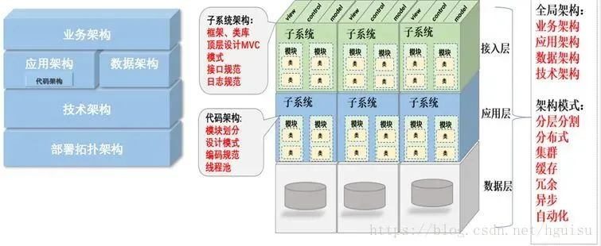
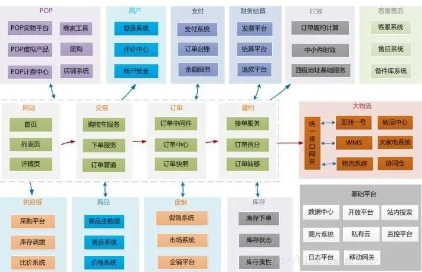
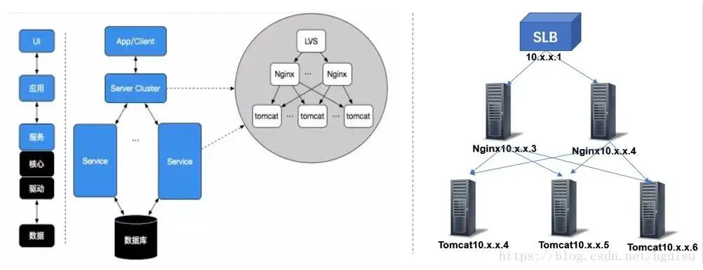

> 作者: 小笼包  
> 2022-09-27 晴

## 什么是架构

架构是经过系统性地思考, 权衡利弊之后在现有资源约束下的最合理决策, 最终明确的系统骨架: 包括子系统, 模块, 组件. 以及他们之间协作关系, 约束规范, 指导原则。
并由它来指导团队中的每个人思想层面上的一致。

- 系统性思考的合理决策：比如技术选型、解决方案等。

- 明确的系统骨架：明确系统有哪些部分组成。

- 系统协作关系：各个组成部分如何协作来实现业务请求。

- 约束规范和指导原则：保证系统有序，高效、稳定运行。

因此架构师具备能力：**理解业务，全局把控，选择合适技术，解决关键问题、指导研发落地实施。**

### 1、系统与子系统

**系统：** 泛指由一群有关联的个体组成，根据某种规则运作，能完成个别元件不能独立完成的工作能力的群体。

**子系统：** 也是由一群关联的个体组成的系统，多半是在更大的系统中的一部分。

### 2、模块与组件

都是系统的组成部分，从不同角度拆分系统而已。模块是逻辑单元，组件是物理单元。  

模块就是从逻辑上将系统分解， 即分而治之， 将复杂问题简单化。模块的粒度可大可小， 可以是系统，几个子系统、某个服务，函数， 类，方法、 功能块等等。  

组件可以包括应用服务、数据库、网络、物理机、还可以包括MQ、容器、Nginx等技术组件。  

### 3、框架与架构

框架是组件实现的规范，例如：MVC、MVP、MVVM等，是提供基础功能的产品，例如开源框架：Ruby on Rails、Spring、Laravel、Django等，这是可以拿来直接使用或者在此基础上二次开发。
框架是规范，架构是结构。

## 架构的本质是什么呢？

**架构的本质**就是对系统进行有序化地重构以致符合当前业务的发展，并可以快速扩展。  

那么架构的发展、需求和设计都是基于业务的驱动。

- 需求相对复杂。

- 非功能性需求在整个系统占据重要位置.

- 系统生命周期长,有扩展性需求。

- 系统基于组件或者集成的需要。

- 业务流程再造的需要。

## 架构的分层和分类

**架构分类**可细分为业务架构、应用架构、技术架构, 代码架构, 部署架构。

业务架构是战略，应用架构是战术，技术架构是装备。其中应用架构承上启下，一方面承接业务架构的落地，另一方面影响技术选型。  

熟悉业务，形成业务架构，根据业务架构，做出相应的应用架构，最后技术架构落地实施。

如何针对当前需求，选择合适的应用架构，如何面向未来，保证架构平滑过渡，这个是软件开发者，特别是架构师，都需要深入思考的问题。  

### 1、业务架构（俯视架构）

包括业务规划，业务模块、业务流程，对整个系统的业务进行拆分，对领域模型进行设计，把现实的业务转化成抽象对象。  

没有最优的架构，只有最合适的架构，一切系统设计原则都要以解决业务问题为最终目标，脱离实际业务的技术情怀架构往往会给系统带入大坑，任何不基于业务做异想天开的架构都是耍流氓。  

所有问题的前提要搞清楚我们今天面临的业务量有多大，增长走势是什么样，而且解决高并发的过程，一定是一个循序渐进逐步的过程。合理的架构能够提前预见业务发展1~2年为宜。这样可以付出较为合理的代价换来真正达到技术引领业务成长的效果。

### 2、应用架构（剖面架构，也叫逻辑架构图）

硬件到应用的抽象，包括抽象层和编程接口。应用架构和业务架构是相辅相成的关系。业务架构的每一部分都有应用架构。  

**应用架构：**应用作为独立可部署的单元，为系统划分了明确的边界，深刻影响系统功能组织、代码开发、部署和运维等各方面. 应用架构定义系统有哪些应用、以及应用之间如何分工和合作。这里所谓应用就是各个逻辑模块或者子系统。  

应用架构图关键有2点：

1)、 职责划分: 明确应用（各个逻辑模块或者子系统）边界

- 逻辑分层

- 子系统、模块定义。

- 关键类

2)、职责之间的协作：

- 接口协议：应用对外输出的接口。

- 协作关系：应用之间的调用关系。

#### 应用分层两种方式

##### 1、水平分（横向）

按照功能处理顺序划分应用，比如把系统分为web前端/中间服务/后台任务，这是面向业务深度的划分。

##### 2、垂直分（纵向）

按照不同的业务类型划分应用，比如进销存系统可以划分为三个独立的应用，这是面向业务广度的划分。

应用的**合**反映应用之间如何协作，共同完成复杂的业务case，主要体现在应用之间的通讯机制和数据格式，通讯机制可以是同步调用/异步消息/共享DB访问等，数据格式可以是文本/XML/JSON/二进制等。

应用的**分**偏向于业务，反映业务架构，应用的**合**偏向于技术，影响技术架构。

应用的**分**降低了业务复杂度，系统更有序，应用的**合**增加了技术复杂度，系统更无序。

**应用架构的本质**是通过系统拆分，平衡业务和技术复杂性，保证系统形散神不散。

系统采用什么样的应用架构，受业务复杂性影响，包括企业发展阶段和业务特点；同时受技术复杂性影响，包括IT技术发展阶段和内部技术人员水平。业务复杂性（包括业务量大）必然带来技术复杂性，应用架构目标是解决业务复杂性的同时，避免技术太复杂，确保业务架构落地。

### 3、数据架构

数据架构指导数据库的设计. 不仅仅要考虑开发中涉及到的数据库，实体模型，也要考虑物理架构中数据存储的设计。

### 4、代码架构（也叫开发架构）

子系统代码架构主要为开发人员提供切实可行的指导，如果代码架构设计不足，就会造成影响全局的架构设计。比如公司内不同的开发团队使用不同的技术栈或者组件，结果公司整体架构设计就会失控。

代码架构主要定义：

1)、代码单元:

- 配置设计

- 框架、类库

2)、代码单元组织：

- 编码规范，编码的惯例

- 项目模块划分

- 顶层文件结构设计，比如mvc设计

- 依赖关系

### 5、技术架构

确定组成应用系统的实际运行组件（lvs，nginx，tomcat，php-fpm等），这些运行组件之间的关系，以及部署到硬件的策略。

技术架构主要考虑系统的非功能性特征，对系统的高可用、高性能、扩展、安全、伸缩性、简洁等做系统级的把握。

系统架构的设计要求架构师具备软件和硬件的功能和性能的过硬知识，这也是架构设计工作中最为困难的工作。

### 6、部署拓扑架构图（实际物理架构图）

拓扑架构，包括架构部署了几个节点，节点之间的关系，服务器的高可用，网路接口和协议等，决定了应用如何运行，运行的性能，可维护性，可扩展性，是所有架构的基础。这个图主要是运维工程师主要关注的对象。

物理架构主要考虑硬件选择和拓扑结构，软件到硬件的映射，软硬件的相互影响。  

转载至：<https://mp.weixin.qq.com/s/N0RB4_G9_UsDjFvnKifIbA>
