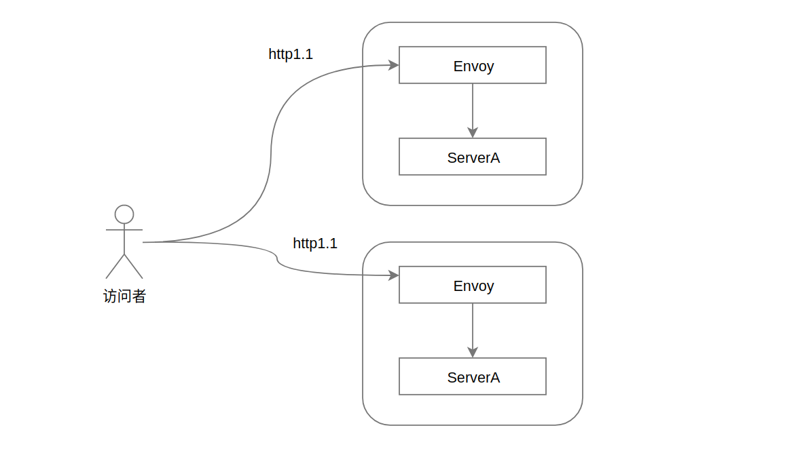
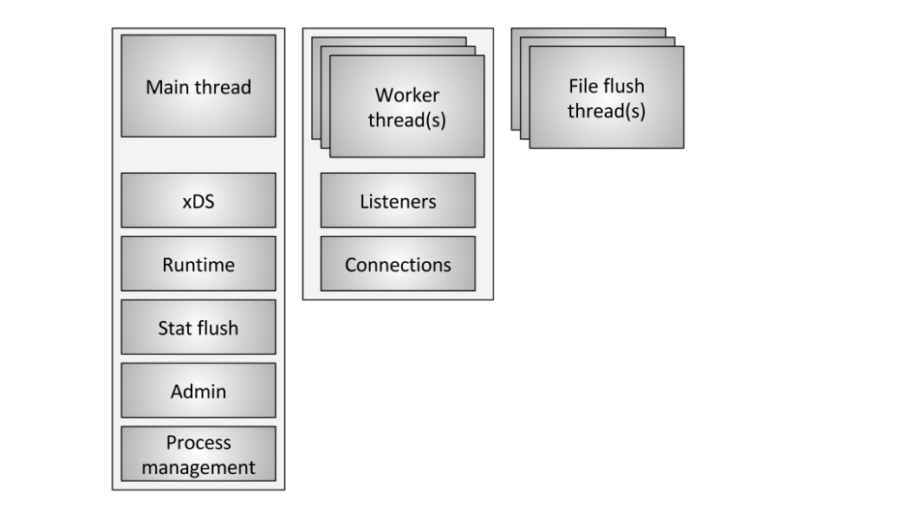
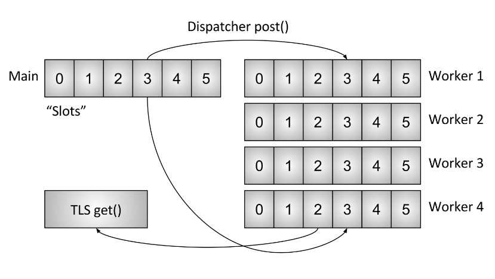
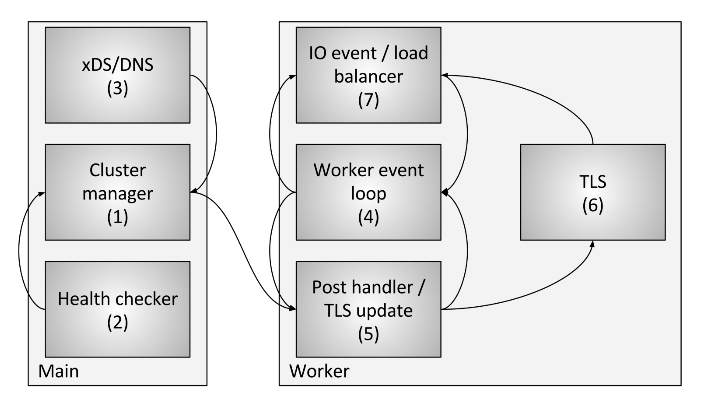

## 初识Envoy

> 作者: 小笼包  
> 2020-05-20 晴

### Envoy是什么

Envoy是一个七层负载均衡的代理，专门为现代大型服务方向架构设计。  

简单来说Envoy是一种"服务网格"，为各种语言的应用程序提供通用的基础类库，例如：  

服务发现、负载均衡、服务限流、断路器、可观测性（统计）、日志、链路追踪 等功能。

<!-- more -->

### Envoy理念基于什么

Envoy设计初衷理念 ： The network should be transparent to applications. When network and application problems do occur, it should be easy to determine the source of the problem.  （网络对于应用应该是透明的，当网络和应用出现问题时，应该很容易找到问题的根源）。

### Envoy的一些故事分享

1、**Matt Klein（马特-克莱因） ：**  现Envoy开源社区负责人，Lyft公司工程师。  

> [Matt Klein的推特](https://twitter.com/mattklein123)

2、Envoy在开源成立前，由Lyft公司研发与使用大概长达1.5年时间，主要想解决Lyft公司零星  
的网络和服务调用失败的持续问题，以至于大多数开发人员都不敢在关键路径上进行大量的服务  
调用。难以理解问题发生在何处，最终Lyft公司还通过Envoy替代了基础架构中对Amazon的ELB  
使用。  

> [参考Matt Klein写的文章(Announcing Envoy: C++ L7 proxy and communication bus)](https://eng.lyft.com/announcing-envoy-c-l7-proxy-and-communication-bus-92520b6c8191)  

3、当Envoy正式成立开源之后，大量Google的开发人员参与为Envoy开源推广添砖加瓦，不久Lyft和Google  
联合推出了istio，很快也受到很多云原生大厂的喜爱，陆续的其他开源社区大佬都加入到了Envoy开源社区，国内蚂蚁金服的云原生布道者Jimmy Song为Envoy文档提供了中文版文档，在这里感谢这些大佬，使得我们接下来了解和学习Envoy、ServerMesh有了一个良好的环境。    

4、Matt Klein 并没有与微服物布道者(克里斯-理查森)一样开设公司专职于Envoy推广，反而崇尚开源精神，完全交给开源社区，并与开源社区一起努力推广Envoy，本人也是非常倾佩这样行为（确实Envoy的成功可以为他增加很多用他的词汇就是更多的货币收入），相信开源社区。  

> [详见（Optimizing impact: why I will not start an Envoy platform company）](https://medium.com/@mattklein123/optimizing-impact-why-i-will-not-start-an-envoy-platform-company-8904286658cb)

### Envoy现有基础功能简单介绍

1、**进程外的架构模式 :** Envoy是一个自包含的流程，旨在与每个应用程序服务器一起运行。所有的Envoy都构成一个透明的通信网，每个应用程序在其中都与localhost之间发送和接收消息，并且不知道网络拓扑。与传统库方法进行服务到服务的通信相比，进程外架构具有两个实质性的好处：  

- Envoy可与任何应用程序语言一起使用。单个Envoy部署可以在Java，C ++，Go，PHP，Python等之间形成网格。面向服务的体系结构使用多种应用程序框架和语言正变得越来越普遍。特使透明地弥合了差距。  

- 任何使用大型面向服务的体系结构的人都知道，部署库升级可能非常痛苦。Envoy可以透明地在整个基础架构中快速部署和升级。  



2、**现代C ++ 11代码库 :** Envoy用C ++ 11编写。选择本机代码是因为我们认为，Envoy之类的体系结构组件应尽可能避免使用。由于共享云环境中的部署以及使用生产力很高但性能不是特别好的语言（例如PHP，Python，Ruby，Scala等），现代应用程序开发人员已经处理了难以解释的尾部延迟。本机代码通常可提供出色的延迟属性，不会给已经令人困惑的情况带来额外的混乱。与其他用C编写的本机代码代理解决方案不同，C ++ 11提供了出色的开发人员生产力和性能。  

3、**L3 / L4过滤器体系结构 :** Envoy是L3 / L4网络代理。可插入的 过滤器链机制允许编写过滤器以执行不同的TCP代理任务，并将其插入主服务器。已经编写了过滤器来支持各种任务，例如原始TCP代理， HTTP代理，TLS客户端证书认证等。  

4、**HTTP L7筛选器体系结构 :** HTTP是现代应用程序体系结构的关键组成部分，Envoy 支持附加的HTTP L7筛选器层。可以将HTTP过滤器插入HTTP连接管理子系统，该子系统执行不同的任务，例如缓冲，速率限制，路由/转发，嗅探Amazon的DynamoDB等。  

5、**一流的HTTP/2支持 :** 在HTTP模式下运行时，Envoy 支持 HTTP/1.1和HTTP/2。Envoy可以在两个方向上充当透明的HTTP/1.1到HTTP/2代理。这意味着可以桥接HTTP/1.1和HTTP/2客户端与目标服务器的任何组合。建议的服务到服务配置使用所有Envoy之间的HTTP/2来创建持久连接的网格，可以在请求和响应之间进行多路复用。Envoy不支持SPDY，因为该协议正在逐步淘汰。  

6、**HTTP L7路由 :** 在HTTP模式下运行时，Envoy支持一个 路由子系统，该子系统能够基于路径，权限，内容类型，运行时值等来路由和重定向请求。当使用Envoy作为前端/边缘时，此功能最有用代理，但在构建服务到服务网格时也会利用。  

7、**gRPC支持 :** gRPC是Google的RPC框架，它使用HTTP/2作为基础的多路复用传输。Envoy支持所有必须用作gRPC请求和响应的路由和负载平衡基础的HTTP/2功能。这两个系统是非常互补的。  

8、**MongoDB L7支持 :** MongoDB是现代Web应用程序中使用的流行数据库。Envoy支持MongoDB连接的L7嗅探，统计信息生成和日志记录。  

9、**DynamoDB L7支持 :** DynamoDB是Amazon托管的键/值NOSQL数据存储。Envoy支持DynamoDB连接的L7嗅探和统计信息生成。  

10、**服务发现和动态配置 :** Envoy可以选择使用一组分层的动态配置API进行集中管理。这些层为Envoy提供有关以下方面的动态更新：后端群集中的主机，后端群集本身，HTTP路由，侦听套接字和加密材料。对于更简单的部署，可以通过DNS解析 （甚至 完全跳过）来完成后端主机发现 ，而将其他层替换为静态配置文件。  

11、**运行状况检查 :** 构建Envoy网格的推荐方法是将服务发现视为最终一致的过程。Envoy包括一个运行状况检查子系统，该子系统可以有选择地对上游服务集群执行活动的运行状况检查。然后，Envoy使用服务发现和运行状况检查信息的结合来确定运行状况良好的负载平衡目标。Envoy还通过异常值检测子系统支持被动健康检查。  

12、**高级负载平衡 :** 分布式系统中不同组件之间的负载平衡是一个复杂的问题。由于Envoy是一个自包含的代理，而不是库，因此它能够在一个地方实现高级负载平衡技术，并使任何应用程序都可以访问它们。目前，Envoy包括对自动重试，断路， 通过外部速率限制服务进行全局速率限制， 请求屏蔽和异常检测的支持。未来还计划支持请求竞争。  

13、**前端/边缘代理支持 :** 尽管Envoy主要是作为服务通信系统的服务而设计的，但是在边缘使用相同的软件（可观察性，管理，相同的服务发现和负载平衡算法等）会有所帮助。Envoy包含足够的功能，使其可以用作大多数现代Web应用程序用例的边缘代理。这包括 TLS终止，HTTP/1.1和HTTP/2支持以及HTTP L7路由。  

14、**一流的可观察性 :** Envoy的主要目标是使网络透明。但是，问题在网络级别和应用程序级别都会发生。Envoy包括对所有子系统的强大统计支持。statsd（和兼容的提供程序）是当前受支持的统计接收器，尽管插入其他资源并不困难。还可以通过管理端口查看统计信息。Envoy还支持通过第三方提供商进行分布式 跟踪。  

> [参考(What is Envoy)](https://www.envoyproxy.io/docs/envoy/latest/intro/what_is_envoy)

### Envoy的线程模型是如何的

Envoy使用单进程-多线程的架构模型。一个Master主线程控制各种琐碎的任务，同时一些工作线程执行侦听，过滤、筛选和转发。每个Listener（监听器）与一个工作线程绑定完成其整个生命周期， Envoy主要使用大量单线程(embarrassingly parallel)处理工作，并且只有少量的复杂代码用于实现worker线程之间的协调工作。通常，Envoy被编写为100％非阻塞的，对于大多数工作负载，我们建议将工作线程的数量配置为等于计算机上的硬件线程的数量。  

默认情况下工作线程之间并没有协调，所有工作线程都独立地尝试接受每个侦听器上的连接，并依靠内核在线程之间执行适当的平衡。对于大多数工作负载，内核在平衡传入连接方面做得非常好。但是，对于某些工作负载，尤其是那些具有很少的非常长寿命的连接的工作负载（例如，服务网格HTTP2/gRPC出口），可能需要让Envoy强制平衡工作线程之间的连接。为了支持此行为，Envoy允许在每个侦听器上配置不同类型的连接平衡。  

> [参考 Threading model](https://www.envoyproxy.io/docs/envoy/latest/intro/arch_overview/intro/threading_model)  

  

Envoy使用三种不同类型的线程，如图一所示:  

1、**Main :** Envoy的主线程，主线程用来启动或者关闭服务，同时对xDS API进行处理（包括DNS，运行状况检查和常规群集管理），运行时，统计信息刷新，管理和常规进程管理（信号，热重启等）。该线程上发生的所有事情都是异步的并且是“非阻塞的”。通常，主线程协调所有不需要大量CPU即可完成的关键过程功能。这使得大多数管理代码都可以写为单线程。  

2、**Worker :** Envoy的工作线程，默认情况下，Envoy为系统中的每个硬件线程生成一个工作线程。（这可以通过--concurrency选项控制）。每个工作线程运行一个“非阻塞”事件循环，该事件循环负责在每个侦听器上侦听（当前没有侦听器分片），接受新连接，为该连接实例化过滤器堆栈以及在整个生命周期内处理所有IO。连接。同样，这允许大多数连接处理代码被编写为好像是单线程的。  

3、**文件刷新器 :** Envoy写入的每个文件（主要是访问日志）当前都有一个独立的阻塞刷新线程。因为即使使用写入文件系统缓存的文件O_NONBLOCK有时也会阻塞。当工作线程需要写入文件时，实际上会将数据移入内存缓冲区，并最终通过文件刷新线程将其刷新。这是代码中的一个区域，从技术上讲，所有工作线程都可以在同一锁上进行阻塞，以尝试填充内存缓冲区。还有其他一些将在下面进一步讨论。  

#### 连接处理

所有工作线程在没有分片的情况下监听所有的监听器，因此内核可以智能的为工作线程分配套接字。现代的内核一般都很擅长处理这个。他们使用诸如IO优先级提升之类的功能来尝试填充线程的工作，然后尝试使用其他线程去监听相同的套接字,以及不会去使用单个自旋锁去处理每个接受。  

一旦连接被worker接受，它就永远不会离开那个worker。所有进一步的连接处理都在工作线程内完全处理，包括任何转发行为。这里存在一些重要含义：  

- Envoy中的所有连接池都是每个工作线程。 因此，尽管HTTP / 2连接池一次只与每个上游主机建立一个连接，但如果有四个工作站，则每个上游主机在稳定状态下将有四个HTTP/2连接。  

- Envoy以这种方式工作的原因是因为通过将所有代码保存在单个工作线程中，几乎所有代码都可以在没有锁的情况下编写，就像它是单线程一样。 这种设计使得大多数代码更易于编写，并且可以非常好地扩展到几乎无限数量的worker。  

- 然而，一个主要的问题是，从内存和连接池效率的角度来看，调整并发选项实际上非常重要。 拥有比所需更多的worker将浪费内存，创建更多空闲连接，并导致更低的连接池命中率。 在Lyft，我们的 sidecar Envoy以非常低的并发性运行，因此性能大致与他们旁边的服务相匹配。 我们只以最大并发性运行我们的边缘Envoy。  

#### 什么是非阻塞

到目前为止，在讨论主线程和工作线程如何操作时，已经多次使用术语“非阻塞”。 所有代码都是在假设没有任何阻塞的情况下编写的。 然而，这并不完全正确（完全是这样的吗？）。 Envoy 确实采用了一些进程宽锁：  

- 如前所述，如果正在写入访问日志，则所有工作程序在填充内存访问日志缓冲区之前都会获取相同的锁。 锁定保持时间应该非常低，但是这种锁可以在高并发性和高吞吐量下竞争。  

- Envoy采用了一个非常复杂的系统来处理线程本地的统计数据。 这将是一个单独的帖子的主题。 但是，我将简要提一下，作为线程本地统计处理的一部分，有时需要获取对中央“stat store”的锁定。这种锁定不应该高度争用。  

- 主线程需要定期与所有工作线程协调。 这是通过从主线程“发布”到工作线程（有时从工作线程返回到主线程）来完成的。 发布需要锁定，以便将发布的消息放入队列中以便以后发送。 这些锁永远不应该高度争用，但它们仍然可以在技术上阻止。  

- 当Envoy将自己记录到标准错误时，它会获取进程范围的锁定。 一般来说，Envoy本地记录被认为是表现糟糕的，所以没有多少考虑改善这一点。  

- 还有一些其他随机锁，但它们都不在性能关键路径中，永远不应该争用。  

#### 线程本地存储

由于Envoy将主线程职责与工作线程职责分开，因此需要在主线程上完成复杂处理，然后以高度并发的方式使每个工作线程可用。 本节介绍了Envoy的高级线程本地存储（TLS）系统。 在下一节中，我将描述如何使用它来处理集群管理。  

  

如已经描述的那样，主线程基本上处理Envoy过程中的所有管理/控制平面功能。 （控制平面在这里有点过载但是当在Envoy进程中考虑并与工人做的转发进行比较时，似乎是合适的）。 主线程进程执行某些工作是一种常见模式，然后需要使用该工作的结果更新每个工作线程，并且工作线程不需要在每次访问时获取锁定。  

Envoy的TLS系统的工作原理如下：  

- 在主线程上运行的代码可以分配进程范围的TLS槽。 虽然是抽象的，但实际上，这是一个允许O（1）访问的向量索引。  

- 主线程可以将任意数据设置到其槽中。 完成此操作后，数据将作为正常事件循环事件发布到每个工作程序中。  

- 工作线程可以从其TLS槽读取，并将检索那里可用的任何线程本地数据。  

虽然非常简单，但这是一个非常强大的范例，与RCU锁定概念非常相似。 （实质上，工作线程在工作时从不会看到TLS插槽中的数据发生任何变化。更改只发生在工作事件之间的静止期间）。 Envoy以两种不同的方式使用它：  

- 通过在没有任何锁定的情况下访问每个工作人员存储不同的数据。  

- 通过将共享指针存储到每个worker的只读全局数据。 因此，每个工作者都具有对在工作时不能递减的数据的引用计数。 只有当所有工作人员都已停顿并加载新的共享数据时，旧数据才会被销毁。 这与RCU相同。  

#### 集群线程更新

在本节中，我将描述TLS如何用于集群管理。 集群管理包括xDS API处理和/或DNS以及运行状况检查。  

  

总体流程：  

- 集群管理器是Envoy内部的组件，用于管理所有已知的上游集群，CDS API，SDS / EDS API，DNS和活动（带外）运行状况检查。 它负责创建每个上游集群的最终一致视图，其中包括已发现的主机以及运行状况。  

- 运行状况检查程序执行活动运行状况检查，并将运行状况更改报告回集群管理器。  

- 执行CDS/SDS/EDS/DNS以确定集群成员资格。 状态更改将报告回集群管理器。  

- 每个工作线程都在不断运行事件循环。  

- 当集群管理器确定集群的状态已更改时，它会创建集群状态的新只读快照，并将其发布到每个工作线程。  

- 在下一个静止期间，工作线程将更新分配的TLS插槽中的快照。  

- 在需要确定要负载均衡的主机的IO事件期间，负载均衡器将在TLS插槽中查询主机信息。 没有获得锁定来执行此操作。 （另请注意，TLS还可以在更新时触发事件，以便负载平衡器和其他组件可以重新计算高速缓存，数据结构等。这超出了本文的范围，但在代码中的各个位置使用）。  

通过使用先前描述的过程，Envoy能够处理每个请求而不需要任何锁定（除了之前描述的那些）。 除了TLS代码本身的复杂性之外，大多数代码都不需要理解线程如何工作，并且可以编写为单线程。 这使得大多数代码更容易编写，并产生出色的性能。  

#### 其他使用TLS的子系统

TLS和RCU在Envoy中广泛使用。 其他一些例子包括：  

- 运行时（功能标志）覆盖查找：在主线程上计算当前功能标志覆盖映射。 然后使用RCU语义为每个工作程序提供只读快照。  

- 路由表交换：对于RDS提供的路由表，路由表在主线程上实例化。 然后使用RCU语义为每个工作程序提供只读快照。 这使得路由表交换有效地原子化。  

- HTTP日期标头缓存：事实证明，在每个请求上计算HTTP日期标头（当每个核心执行~25K + RPS时）非常昂贵。 Envoy大约每半秒计算一次日期标题，并通过TLS和RCU将其提供给每个工作人员。  

还有其他情况，但前面的例子应该提供TLS所用事物的良好品味。  

#### 已知的性能陷阱

虽然Envoy整体表现相当不错，但是当它以非常高的并发性和吞吐量使用时，有一些已知领域需要注意：  

- 正如本文中已经描述的那样，当前所有工作者在写入访问日志的内存缓冲区时都会获得锁定。 在高并发性和高吞吐量的情况下，当写入最终文件时，将需要以按顺序交付为代价对每个工作人员批量访问日志进行批处理。 或者，访问日志可以成为每个工作线程。  

- 尽管统计信息已经过非常优化，但在非常高的并发性和吞吐量下，个别统计信息可能存在原子争用。 对此的解决方案是每个工人计数器，定期冲洗到中央计数器。 这将在后续文章中讨论。  

- 如果Envoy部署在几乎没有需要大量资源来处理的连接的场景中，现有架构将无法正常运行。 这是因为无法保证连接在工作人员之间均匀分布。 这可以通过实现工作者连接平衡来解决，其中工作人员能够将连接转发给另一个工作人员进行处理。  

#### 结论

Envoy的线程模型旨在支持编程的简单性和大规模并行性，但如果调整不当可能会浪费内存和连接使用。 该模型允许它在非常高的worker数量和吞吐量下表现良好。  

正如我在Twitter上简要提到的那样，该设计也适合在DPDK之类的完整用户模式网络堆栈上运行，这可能导致商用服务器在执行完整的L7处理时每秒处理数百万个请求。看看未来几年建成什么会非常有趣。  

最后一个快速评论：我多次被问到为什么我们为Envoy选择C++。 原因仍然是它仍然是唯一广泛部署的生产级语言，使用该语言中可以构建本文中描述的架构。 C++当然不适合所有项目，甚至许多项目，但对于某些用例，它仍然是完成工作的唯一工具。  

本文中讨论的一些接口和实现头的一些链接：  

- https://github.com/lyft/envoy/blob/master/include/envoy/thread_local/thread_local.h
- https://github.com/lyft/envoy/blob/master/source/common/thread_local/thread_local_impl.h
- https://github.com/lyft/envoy/blob/master/include/envoy/upstream/cluster_manager.h
- https://github.com/lyft/envoy/blob/master/source/common/upstream/cluster_manager_impl.h

### 上手试连，通过Envoy实现一个百度简单代理

通过Envoy去做一个简单的代理访问百度，话不多说配置伺候:  

``` yaml
admin:
  access_log_path: /tmp/admin_access.log
  address:
    socket_address: { address: 0.0.0.0, port_value: 10000 }
```

配置管理端口，管理端口可以访问envoy相关的配置信息，状态信息等等。  

``` yaml
listeners:
  - name: listener_0
    address:
      socket_address: { address: 0.0.0.0, port_value: 8000 }
    filter_chains:
    - filters:
      - name: envoy.http_connection_manager
        config:
          stat_prefix: ingress_http
          codec_type: AUTO
          route_config:
            name: local_route
            virtual_hosts:
            - name: local_service
              domains: ["*"]
              routes:
              - match: { prefix: "/" }
                route: { host_rewrite: www.baidu.com, cluster: service_baidu }
          http_filters:
          - name: envoy.router
```

配置静态资源的监听，监听8000端口，路由匹配"/"（相当于能匹配任意路由近来），会进行主机跳转到百度域名，访问集群配置名称为"service_baidu"。  

``` yaml
clusters:
  - name: service_baidu
    connect_timeout: 0.25s
    type: LOGICAL_DNS
    # Comment out the following line to test on v6 networks
    dns_lookup_family: V4_ONLY
    lb_policy: ROUND_ROBIN
    load_assignment:
      cluster_name: service_baidu
      endpoints:
      - lb_endpoints:
        - endpoint:
            address:
              socket_address:
                address: www.baidu.com
                port_value: 443
    tls_context:
        sni: www.baidu.com
```

配置集群信息，集群名字与监听配置上路由里面指定集群名称一致，当请求近来时候匹配上路由之后，进行主机跳转并通过寻找集群信息访问配置上的"socket_address"下的地址访问，然后成功跳转到百度。  

具体代码可以参考： [Envoy代理demo](https://github.com/SimpleDays/studyessay/tree/master/envoy/demo/proxy-demo)  

> [线程模型的介绍](https://blog.envoyproxy.io/envoy-threading-model-a8d44b922310)  

### 相关Envoy资料

- [Envoy官网文档](https://www.envoyproxy.io/docs/envoy/latest/)  

- [Envoy的Github社区](https://github.com/envoyproxy)  

- [Envoy的Medium博客](https://blog.envoyproxy.io/)  

- [Envoy的官方推特博客](https://twitter.com/EnvoyProxy)  

- [Matt Klein的Meduim博客](https://medium.com/@mattklein123)  

- [Matt Klein的特推博客](https://twitter.com/mattklein123)  

- [Matt Klein的个人博客](https://mattklein123.dev/)  

- [Envoy的中文文档](https://www.servicemesher.com/envoy/)  

- [ServiceMesher社区](https://www.servicemesher.com/)  

- [ServiceMesher的B站直播（经常办一些线上的服务网格、云原生技术分享）](https://live.bilibili.com/21954520)  

- [本人比较喜欢的一篇关于Service Mesh 发展趋势(续)：棋到中盘路往何方 | Service Mesh Meetup 实录](https://mp.weixin.qq.com/s?__biz=MzIwNDIzODExOA==&mid=2650167335&idx=1&sn=3d57c055b75ad252c0892c554e7a632f&chksm=8ec1c46eb9b64d780e8ef57ba23bd06f6a5acaee09f9f3fe32c00587596a2cac15e365199583&mpshare=1&scene=23&srcid=&sharer_sharetime=1568176218617&sharer_shareid=b9e95083c0081f1a530ee42051f5386)