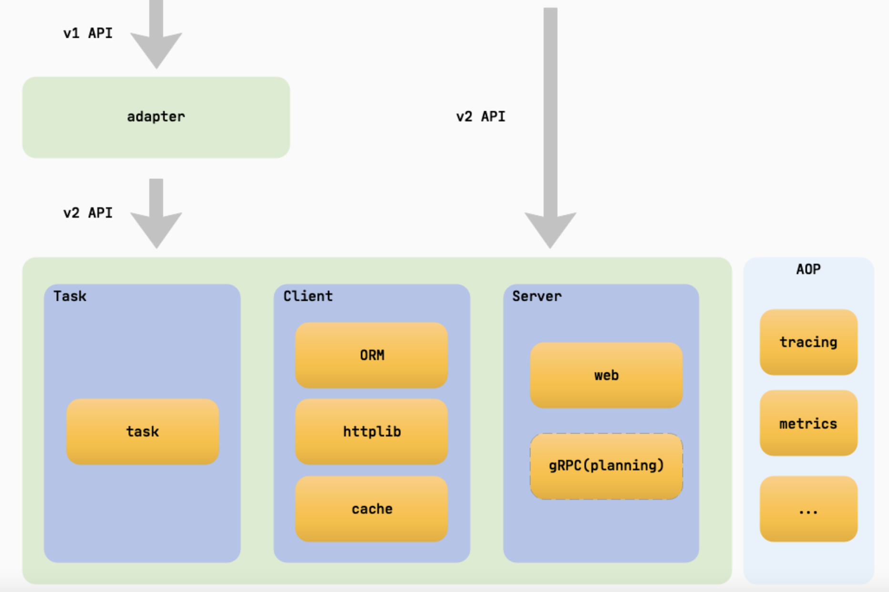
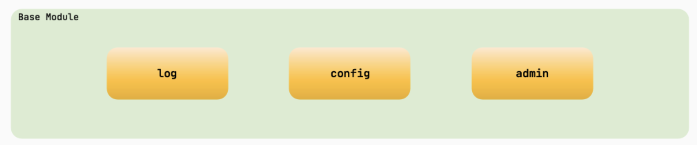
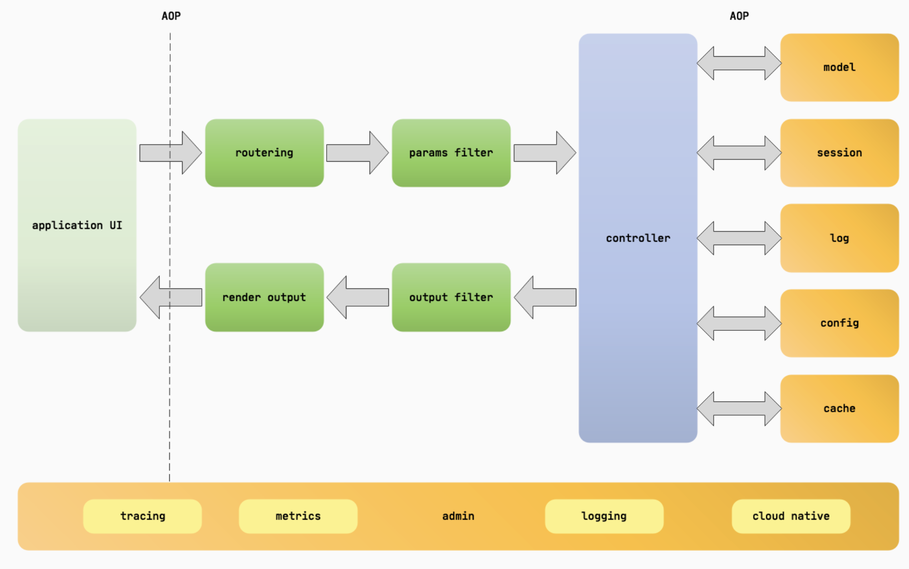
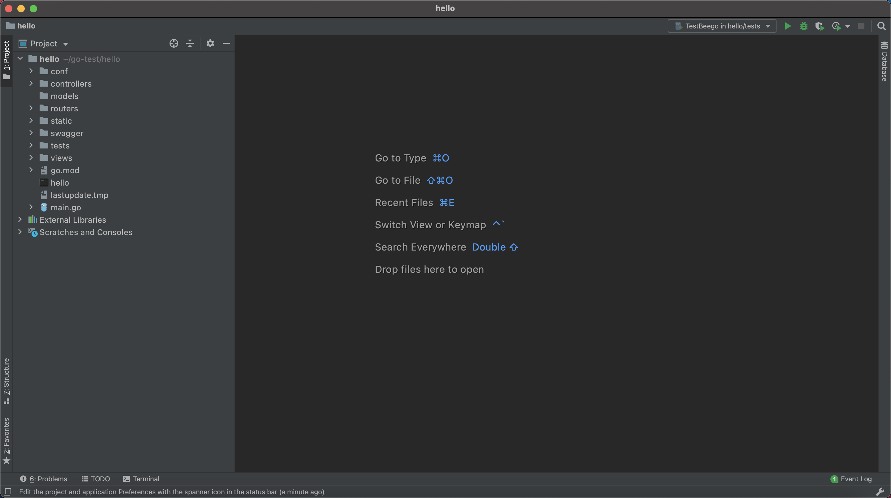
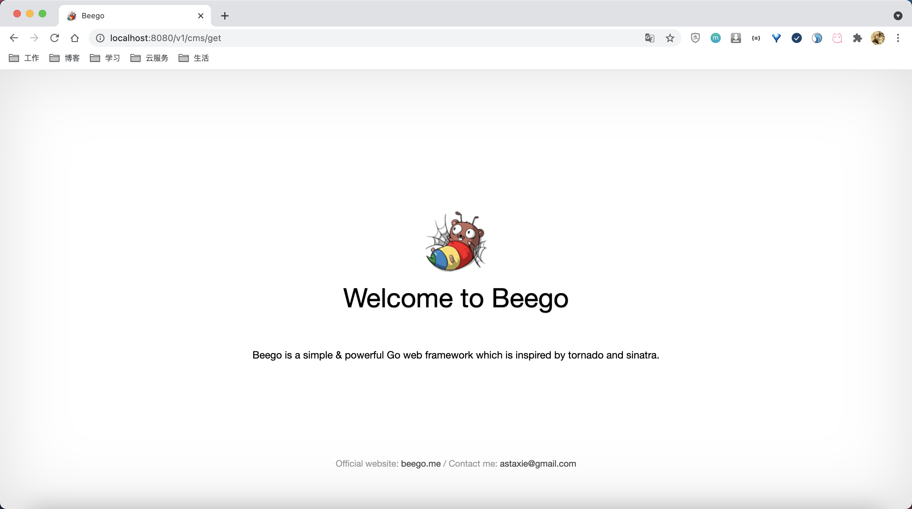

## beego框架的初识  

> 作者: 小笼包  
> 2021-08-15 有雨

### beego简介

beego 是一个快速开发 Go 应用的 HTTP 框架，他可以用来快速开发 API、Web 及后端服务等各种应用，是一个 RESTful 的框架，主要设计灵感来源于 tornado、sinatra 和 flask 这三个框架，但是结合了 Go 本身的一些特性（interface、struct 嵌入等）而设计的一个框架。

<!-- more -->

### beego的架构





beego 是基于八大独立的模块构建的，是一个高度解耦的框架。当初设计 beego 的时候就是考虑功能模块化，用户即使不使用 beego 的 HTTP 逻辑，也依旧可以使用这些独立模块，例如：你可以使用 cache 模块来做你的缓存逻辑；使用日志模块来记录你的操作信息；使用 config 模块来解析你各种格式的文件。所以 beego 不仅可以用于 HTTP 类的应用开发，在你的 socket 游戏开发中也是很有用的模块，这也是 beego 为什么受欢迎的一个原因。大家如果玩过乐高的话，应该知道很多高级的东西都是一块一块的积木搭建出来的，而设计 beego 的时候，这些模块就是积木，高级机器人就是 beego，所以beego中任意的模块都可以被用来独立使用。

### beego的执行逻辑

beego 是一个典型的 MVC 架构，它的执行逻辑如下图所示：



### beego的项目结构

beego 项目的目录如下所示：

``` shell
├── conf
│   └── app.conf
├── controllers
│   ├── admin
│   └── default.go
├── main.go
├── models
│   └── models.go
├── static
│   ├── css
│   ├── ico
│   ├── img
│   └── js
└── views
    ├── admin
    └── index.tpl
```

从上面的目录结构我们可以看出来 M（models 目录）、V（views 目录）和 C（controllers 目录）的结构， main.go 是入口文件。  

### bee工具的介绍

bee 工具是一个为了协助快速开发 beego 项目而创建的项目，通过 bee 您可以很容易的进行 beego 项目的创建、热编译、开发、测试、和部署。
但是我通常只是用它来给我创建一个全新的项目和构建新的API文档使用，简单方便。  

#### bee工具的安装

``` shell
go get -u github.com/beego/bee/v2
```

通过上述命令呢，我们就完成了bee工具简单安装了，但是在下载过程中会遇到一些网络上被墙的问题，因此我们可能需要做如下的一些操作来帮助我们下载bee工具。  

#### 解决bee下载网络被墙的一些问题

目前我们常用的golang版本一般都在1.13版本以上了，目前我在用1.14版本的了，所以我介绍的这个方式推荐把golang版本升级到1.13以上可以考虑试用。

开启golang模块支持, 同时配置golang的goproxy代理地址：

macOS 或 Linux

``` shell
export GO111MODULE=on
export GOPROXY=https://goproxy.cn
```

Windows

``` shell
$env:GO111MODULE = "on"
$env:GOPROXY = "https://goproxy.cn"
```

或者  

``` shell
1. 打开“开始”并搜索“env”
2. 选择“编辑系统环境变量”
3. 点击“环境变量…”按钮
4. 在“<你的用户名> 的用户变量”章节下（上半部分）
5. 点击“新建…”按钮
6. 选择“变量名”输入框并输入“GO111MODULE”
7. 选择“变量值”输入框并输入“on”
8. 点击“确定”按钮
9. 点击“新建…”按钮
10. 选择“变量名”输入框并输入“GOPROXY”
11. 选择“变量值”输入框并输入“https://goproxy.cn”
12. 点击“确定”按钮
```

 同时为了更加方便的操作，请将 $GOPATH/bin 加入到你的 $PATH 变量中。请确保在此之前您已经添加了 $GOPATH 变量
因为我mac的GOPATH目录正好在$HOME的根目录下，所以我在自己配置文件中新增了如下的命令：

 macOS 或 Linux

 ``` shell
echo 'export GOPATH="$HOME/go"' >> ~/.zshrc # 或者 ~/.profile, ~/.cshrc, 您所使用的sh对应的配置文件，或者可以考虑vim直接编辑这个文件

echo 'export PATH="$GOPATH/bin:$PATH"' >> ~/.zshrc # 或者 ~/.profile, ~/.cshrc, 您所使用的sh对应的配置文件

source ~/.zshrc
 ```

 Windows平台在环境变量中同样配置GOPATH和PATH下的bin目录配置即可

 然后我们运行下如下命令确认下bee是否安装成功：

 ``` shell
bee version
 ```

 成功如下所示：

``` shell
 dongliang@dongliangdeMBP~  bee version
______
| ___ \
| |_/ /  ___   ___
| ___ \ / _ \ / _ \
| |_/ /|  __/|  __/
\____/  \___| \___| v2.0.2

├── Beego     : Beego is not installed. Please do consider installing it first: https://github.com/beego/beego/v2. If you are using go mod, and you don't install the beego under $GOPATH/src/github.com/astaxie, just ignore this.
├── GoVersion : go1.14.13
├── GOOS      : darwin
├── GOARCH    : amd64
├── NumCPU    : 8
├── GOPATH    : /Users/dongliang/go
├── GOROOT    : /usr/local/go
├── Compiler  : gc
└── Date      : Sunday, 15 Aug 2021
```

### 本地下载bee项目

根据bee的工具配置我们已经解决了golang获取项目网络问题，这边我们就可以直接通过命令下载或者升级beego项目了：

``` shell
go get -u github.com/beego/beego/v2
```

### 通过bee工具生成一个简单的beego项目

通过 **bee new ｜你的项目名称｜** 来构建一个基础的beego项目

``` shell
bee new hello
```

如图：


然后运行下，提供了一个简单的首页界面展示，这样我们就初步了解了beego的mvc基本使用，后续会对其各个模块进行深入了解，同时了解其api如何自动生成配置文档等。

如图：


### 相关beego资料参考

- [官网文档地址](https://beego.me/)

- [项目地址](https://github.com/beego)

- [bee工具项目地址](https://github.com/beego/bee)
