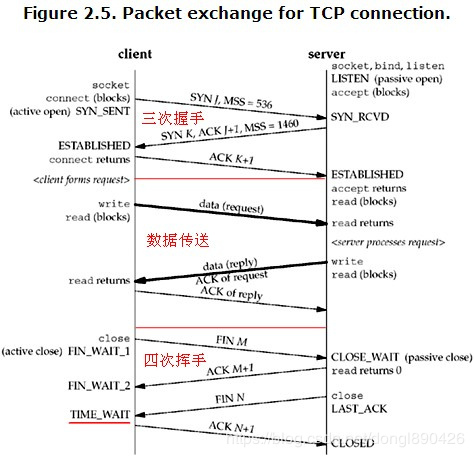

# Linux下netstat命令详解

## 一、介绍
**Netstat**是控制台命令,是一个监控TCP/IP网络的非常有用的工具，它可以显示路由表、实际的网络连接以及每一个网络接口设备的状态信息。Netstat用于显示与**IP、TCP、UDP**和**ICMP**协议相关的统计数据，一般用于检验本机各端口的网络连接情况。

## 二、输出信息描述
执行netstat后输出如下：
```
[root@sy-suz-srv51 ~]# netstat
Active Internet connections (w/o servers)
Proto Recv-Q Send-Q Local Address           Foreign Address         State
tcp        0      0 k8sdev.sui:sun-sr-https k8sdev.dev.com.:34880 SYN_RECV
tcp        0      0 k8sdev.dev.com.c:2379 10.1.62.21:47910        ESTABLISHED
tcp        0      0 k8sdev.suiyi.com.c:2379 k8sdev.dev.com.:37790 ESTABLISHED
tcp        0      0 sy-suz-srv:pcsync-https 10.1.62.162:49200       ESTABLISHED
tcp        0      0 k8sdev.dev.com.:52866 k8sdev.sui:sun-sr-https ESTABLISHED
tcp        0      0 k8sdev.dev.com.:37728 k8sdev.dev.com.c:2379 ESTABLISHED
tcp        0      0 k8sdev.sui:sun-sr-https k8sdev.dev.com.:52852 ESTABLISHED
tcp        0      0 k8sdev.sui:sun-sr-https 10.1.62.162:32841       ESTABLISHED
tcp        0      0 sy-suz-srv:pcsync-https sy-suz-srv51:60094      ESTABLISHED
tcp        0      0 localhost:webcache      localhost:40136         ESTABLISHED
tcp        0      0 k8sdev.dev.com.:35466 10.1.62.21:sun-sr-https ESTABLISHED
tcp        0      0 k8sdev.dev.com.:34358 10.1.62.21:sun-sr-https ESTABLISHED
Active UNIX domain sockets (w/o servers)
Proto RefCnt Flags       Type       State         I-Node   Path
unix  3      [ ]         DGRAM                    18442    /run/systemd/notify
unix  2      [ ]         DGRAM                    18444    /run/systemd/cgroups-agent
unix  2      [ ]         DGRAM                    23822    /var/run/chrony/chronyd.sock
unix  8      [ ]         DGRAM                    18455    /run/systemd/journal/socket
unix  18     [ ]         DGRAM                    18457    /dev/log
unix  2      [ ]         DGRAM                    14151    /var/run/nscd/socket
unix  2      [ ]         DGRAM                    584      /run/systemd/shutdownd
unix  3      [ ]         STREAM     CONNECTED     124439388 /run/dbus/system_bus_socket
unix  3      [ ]         STREAM     CONNECTED     42312    /run/systemd/journal/stdout
unix  3      [ ]         STREAM     CONNECTED     39909
unix  3      [ ]         STREAM     CONNECTED     21675
unix  3      [ ]         STREAM     CONNECTED     47538
unix  3      [ ]         STREAM     CONNECTED     124585242 /var/run/docker/containerd/docker-containerd.sock
unix  3      [ ]         STREAM     CONNECTED     21658
unix  2      [ ]         STREAM     CONNECTED     30160
unix  3      [ ]         STREAM     CONNECTED     33750    /run/systemd/journal/stdout
unix  3      [ ]         STREAM     CONNECTED     124614293 @/containerd-shim/moby/c44e49ee0f86d8a4109afb176701795c64f44655abb1861275bbd3b2a9f76394/shim.sock
unix  3      [ ]         STREAM     CONNECTED     124609611 @/containerd-shim/moby/a736ba153c07f0bbf099ae1a1069530e35bfa28ae93f8f235d6c35a6c5ed9ce7/shim.sock
unix  3      [ ]         STREAM     CONNECTED     124601653 @/containerd-shim/moby/20d3fd59d03455d45b1da2636fca25d0edd79dac1947c17045a797eb8506157c/shim.sock
```
### netstat的输出结果可以分为两个部分
* 1、**Active Internet connections** 有源TCP连接，其中"Recv-Q"和"Send-Q"指接收队列和发送队列。这些数字一般都应该是0。如果不是则表示软件包正在队列中堆积。这种情况只能在非常少的情况见到。
* 2、**Active UNIX domain sockets** 有源Unix域套接口(和网络套接字一样，但是只能用于本机通信，性能可以提高一倍)。

### 列名解释：
> **Proto**：显示连接使用的协议。<br/>
**RefCnt**：表示连接到本套接口上的进程号。<br/>
**Types**：显示套接口的类型。<br/>
**State**：显示套接口当前的状态。<br/>
**Path**：表示连接到套接口的其它进程使用的路径名。<br/>

## 三、netstat常见参数
> **-a (all)** 显示所有选项，默认不显示LISTEN相关。<br/>
**-t (tcp)** 仅显示tcp相关选项。<br/>
**-u (udp)** 仅显示udp相关选项。<br/>
**-n** 拒绝显示别名，能显示数字的全部转化成数字。<br/>
**-l** 仅列出有在 Listen (监听) 的服务状态。<br/>
**-p** 显示建立相关链接的程序名。<br/>
**-r** 显示路由信息，路由表。<br/>
**-e** 显示扩展信息，例如uid等。<br/>
**-s** 按各个协议进行统计。<br/>
**-c** 每隔一个固定时间，执行该netstat命令。<br/>

**LISTEN**和**LISTENING**的状态只有用 **-a** 或者 **-l** 才能看到。

## 四、netstat网络状态详解
一个正常的TCP连接，都会有三个阶段:1、TCP三次握手;2、数据传送;3、TCP四次挥手

如图：



> **SYN**：(同步序列编号,Synchronize Sequence Numbers)该标志仅在三次握手建立TCP连接时有效。表示一个新的TCP连接请求。<br/>

> **ACK**：(确认编号,Acknowledgement Number)是对TCP请求的确认标志,同时提示对端系统已经成功接收所有数据。<br/>

> **FIN**：(结束标志,FINish)用来结束一个TCP回话.但对应端口仍处于开放状态,准备接收后续数据。<br/>

> **LISTEN**：首先服务端需要打开一个socket进行监听，状态为LISTEN， The socket is listening for incoming connections. 侦听来自远方TCP端口的连接请求 。<br/>

> **SYN_SENT**：客户端通过应用程序调用connect进行active open.于是客户端tcp发送一个SYN以请求建立一个连接，之后状态置为SYN_SENT，The socket is actively attempting to establish a connection. 在发送连接请求后等待匹配的连接请求。<br/>

> **SYN_RECV**：服务端应发出ACK确认客户端的SYN，同时自己向客户端发送一个SYN， 之后状态置为SYN_RECV ，
A connection request has been received from the network. 在收到和发送一个连接请求后等待对连接请求的确认 。<br/>

> **ESTABLISHED**：代表一个打开的连接，双方可以进行或已经在数据交互了， The socket has an established connection. 代表一个打开的连接，数据可以传送给用户。<br/>

> **FIN_WAIT1**：主动关闭(active close)端应用程序调用close，于是其TCP发出FIN请求主动关闭连接，之后进入FIN_WAIT1状态。 The socket is closed, and the connection is shutting down. 等待远程TCP的连接中断请求，或先前的连接中断请求的确认。

> **CLOSE_WAIT**：被动关闭(passive close)端TCP接到FIN后，就发出ACK以回应FIN请求(它的接收也作为文件结束符传递给上层应用程序),并进入CLOSE_WAIT， The remote end has shut down, waiting for the socket to close. 等待从本地用户发来的连接中断请求 。

> **FIN_WAIT2**：主动关闭端接到ACK后，就进入了FIN-WAIT-2 ， Connection is closed, and the socket is waiting for a shutdown from the remote end. 从远程TCP等待连接中断请求。

> **LAST_ACK**：被动关闭端一段时间后，接收到文件结束符的应用程序将调用CLOSE关闭连接。这导致它的TCP也发送一个 FIN,等待对方的ACK.就进入了LAST-ACK ， The remote end has shut down, and the socket is closed. Waiting for acknowledgement. 等待原来发向远程TCP的连接中断请求的确认。

> **TIME_WAIT**：在主动关闭端接收到FIN后，TCP就发送ACK包，并进入TIME-WAIT状态。 The socket is waiting after close to handle packets still in the network.等待足够的时间以确保远程TCP接收到连接中断请求的确认。

> **CLOSING**：比较少见， Both sockets are shut down but we still don’t have all our data sent. 等待远程TCP对连接中断的确认。

> **CLOSED**： 被动关闭端在接受到ACK包后，就进入了closed的状态。连接结束， The socket is not being used. 没有任何连接状态。

**TIME_WAIT**状态的形成只发生在主动关闭连接的一方。
主动关闭方在接收到被动关闭方的FIN请求后，发送成功给对方一个ACK后,将自己的状态由FIN_WAIT2修改为TIME_WAIT，而必须再等2倍 的MSL(Maximum Segment Lifetime,MSL是一个数据报在internetwork中能存在的时间)时间之后双方才能把状态 都改为CLOSED以关闭连接。目前RHEL里保持TIME_WAIT状态的时间为60秒。

### Linux的相关keepalive参数
#### 1、tcp_keepalive_time – INTEGER

How often TCP sends out keepalive messages when keepalive is enabled.（Default: 2hours）

一个连接需要TCP开始发送keepalive探测数据包之前的空闲时间，以秒为单位。

#### 2、tcp_keepalive_probes – INTEGER

How many keepalive probes TCP sends out, until it decides that the connection is broken. （Default value: 9）

发送TCP keepalive探测数据包的最大数量，默认是9.如果发送9个keepalive探测包后对端仍然没有响应，就关掉这个连接。

#### 3、tcp_keepalive_intvl – INTEGER

How frequently the probes are send out. Multiplied by tcp_keepalive_probes it is time to kill not responding connection,
after probes started. Default value: 75sec i.e. connection will be aborted after ~11 minutes of retries.

发送两个TCP keepalive探测数据包的间隔时间，默认是75秒。

## 五、常用netstat相关命令
* 1、列出所有端口 `netstat -a`

* 2、列出所有 tcp 端口 `netstat -at`

* 3、列出所有 udp 端口 `netstat -au`

* 4、只显示监听端口 `netstat -l`

* 5、只列出所有监听 tcp 端口 `netstat -lt`

* 6、只列出所有监听 udp 端口 `netstat -lu`

* 7、列出所有监听 UNIX 端口 `netstat -lx`

* 8、显示所有端口的统计信息 `netstat -s`

* 9、显示 TCP 或 UDP 端口的统计信息 `netstat -s` 或 **-su**

* 10、 输出中显示 PID 和进程名称 `netstat -p`

* 11、netstat 输出中不显示主机，端口和用户名 (host, port or user),当你不想让主机，端口和用户名显示，使用 netstat -n。将会使用数字代替那些名称。同样可以加速输出，因为不用进行比对查询:
`netstat -an` <br/>
如果只是不想让这三个名称中的一个被显示，使用以下命令:<br/>
`netsat -a --numeric-ports`<br/>
`netsat -a --numeric-hosts`<br/>
`netsat -a --numeric-users`<br/>

* 12、持续输出 netstat 信息  `netstat -c`

* 13、找出程序运行的端口 `netstat  -ap | grep ':80'`

* 14、查看连接某服务端口最多的的IP地址（前20个）:<br/>
`netstat -nat | grep "10.1.62.23:443" |awk '{print $5}'|awk -F: '{print $1}'|sort|uniq -c|sort -nr|head -20`

* 15、TCP各种状态列表： `netstat -nat |awk '{print $6}'`<br/>
统计数量: `netstat -nat |awk '{print $6}'|sort|uniq -c` <br/>
排序:`netstat -nat |awk '{print $6}'|sort|uniq -c|sort -rn`<br/>
`netstat -n | awk '/^tcp/ {++S[$NF]} END {for(a in S) print a, S[a]}'`

* 16、直接统计tcp数量监听的数量：<br/>
`netstat -ant | wc -l`
