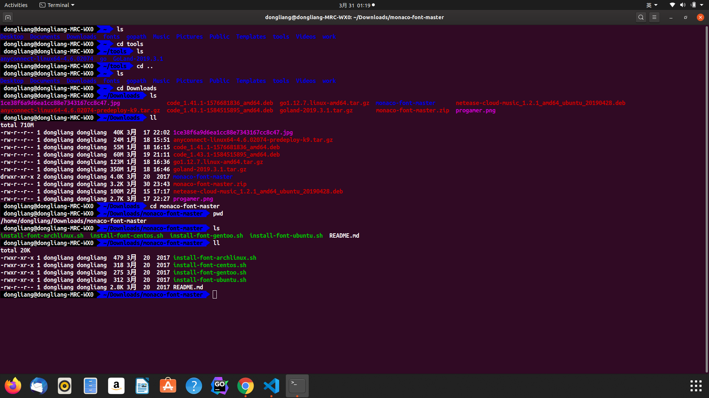

## Linux终端美化

> 作者: 小笼包  
> 2020-03-31 阴

简单的通过 **zsh** 作为默认终端，使用 **agnoster** 主题

## 安装步骤
<!-- more -->
### Ubuntu

1、安装 **zsh**  

``` shell
# sudo apt-get install -y zsh
```

2、安装 **oh-my-zsh** 提供常用的 **zsh** 扩展和主题  

``` shell
# sudo wget --no-check-certificate https://github.com/robbyrussell/oh-my-zsh/raw/master/tools/install.sh -O - | sh
```

3、安装需要的字体  

``` shell
# cd ~

# git clone https://github.com/powerline/fonts.git

# ls -al

# cd fonts

# ./install.sh
```

4、安装pip  

``` shell
# sudo apt-get install python-pip python-dev build-essential

# sudo pip install --upgrade pip

# sudo pip install --upgrade virtualenv
```

5、安装powerline  

``` shell
# pip install --user git+git://github.com/powerline/powerline
```

6、修改 **zsh** 主题配置  

``` shell
# sudo vim ~/.zshrc
```

- 将ZSH_THEME="robbyrussell" 用 # 注释掉，以防以后要改回来。  
- 然后添加 ZSH_THEME="agnoster"，重启机器。
- 打开终端之后修改当前终端字体，把字体设置成Ubuntu Mono derivative Powerline Bold[Regulor][Italic][Bold Italic]四种中的任意一种都可以。

最后发张效果图  

