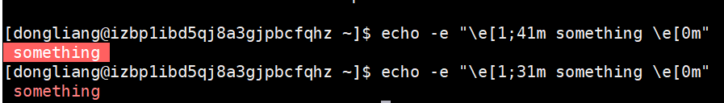
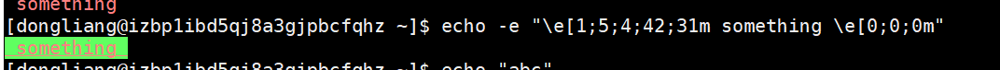

## shell脚本颜色输出

> 作者: 小笼包  
> 2020-03-20 晴

### 什么是shell与shell脚本

Shell 是一个用 C 语言编写的程序，它是用户使用 Linux 的桥梁。  
Shell 既是一种命令语言，又是一种程序设计语言。  
Shell 是指一种应用程序，这个应用程序提供了一个界面，用户通过这个界面访问操作系统内核的服务。  
Shell 脚本（shell script），是一种为 shell 编写的脚本程序。  
<!-- more -->

"#!"是特殊的表示符，其后面根的是此解释此脚本的shell的路径。  
常见的有：  

``` shell
#!/bin/bash
```

``` shell
#!/bin/sh
```

其实第一句的#!是对脚本的解释器程序路径，脚本的内容是由解释器解释的，我们可以用各种各样的解释器来写对应的脚本。  

回归正题，本文主要描述shell中"echo"打印出的字符进行自定义颜色以及背景色等。  

### echo的颜色输出

echo可以控制字体颜色和背景颜色输出。  
**常见的字体颜色：**  
| 颜色 | 作用 | 编码代号 |
| :----: | :----: | :----: |
| ~~ | 重置 | 0 |
| 黑色 | ~~ | 30 |
| 红色 | ~~ | 31 |
| 绿色 | ~~ | 32 |
| 黄色 | ~~ | 33 |
| 蓝色 | ~~ | 34 |
| 紫色 | ~~ | 35 |
| 天蓝色 | ~~ | 36 |
| 白色 | ~~ | 37 |

**常见的背景颜色：**  
| 颜色 | 作用 | 编码代号 |
| :----: | :----: | :----: |
| ~~ | 重置 | 0 |
| 黑色 | ~~ | 40 |
| 红色 | ~~ | 41 |
| 绿色 | ~~ | 42 |
| 黄色 | ~~ | 43 |
| 蓝色 | ~~ | 44 |
| 紫色 | ~~ | 45 |
| 天蓝色 | ~~ | 46 |
| 白色 | ~~ | 47 |

可以发现**字体**颜色在30至40之间，**背景**颜色在40至50之间，0均代表重置。  

我们除了可以指定字体与背景的颜色，我们还可以控制字体展示的一些行为。  
| 作用 | 编码代号 |
| :----: | :----: |
| 字体高亮 | 1 |
| 字体带有下划线 | 4 |
| 字体一直闪烁 | 5 |

接下来我们来上手测试下  
因为需要使用特殊符号，所以需要配合 **-e** 选项来识别特殊符号。  

``` shell
[dongliang@izbp1ibd5qj8a3gjpbcfqhz ~]$ echo -e "\e[1;41m something \e[0m"

[dongliang@izbp1ibd5qj8a3gjpbcfqhz ~]$ echo -e "\e[1;31m something \e[0m"
```



**说明：**  

- **"\e" :** 定义一个转义序列，使用 **"\033"** 也可以代替。

- **"[" :** 表示开始定义颜色。

- **"1" :** 根据上面表格，代表字体高亮。

- **"41 或者 31" :** 根据上面表格，31定义字符串颜色，41定义背景色。

- **"m" :** 代表定义颜色的结束符。

- **最后的"\e[0m" :** 表示重新开启颜色定义，定义字符串或者背景色都是用0，根据表格内容表示重置，重置成默认颜色。

执行稍微复杂点的  

``` shell
[dongliang@izbp1ibd5qj8a3gjpbcfqhz ~]$ echo -e "\e[1;5;4;42;31m something \e[0;0;0m"
```



### 结论

结合上述一些炫酷的展示功能，有效的高亮出我们脚本执行之后需要打印提醒的文字的辨识度。  
例如，我在执行到每一步脚本逻辑时候希望打印一些Debug或者INFO日志，使用这个自定义颜色，可以良好的展示我自己输出的日志信息，简单又方便。
