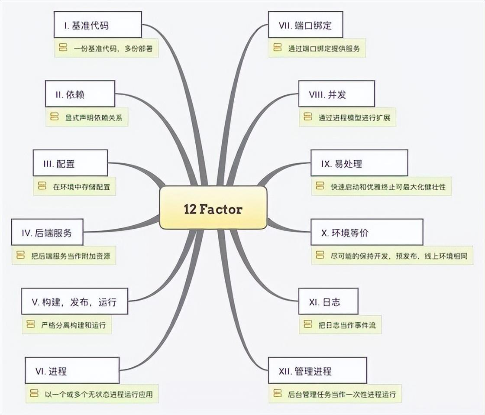
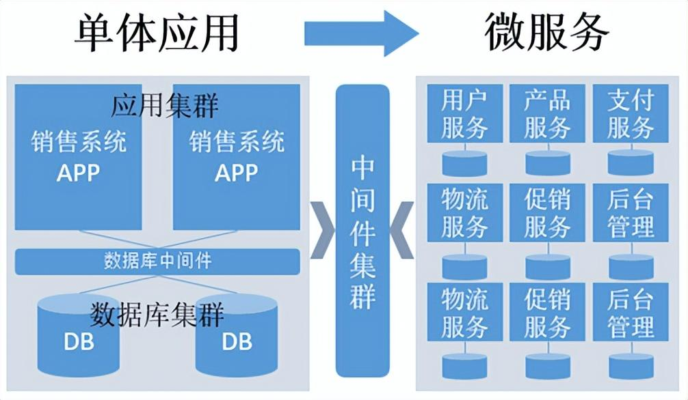
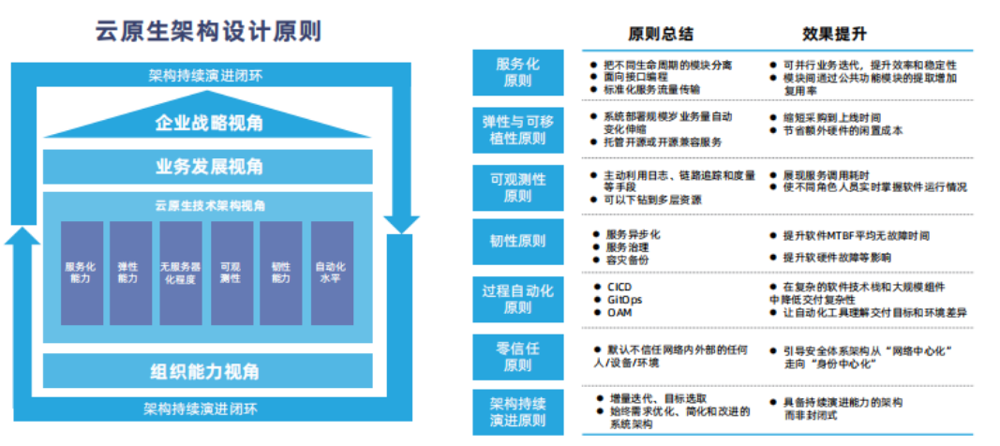
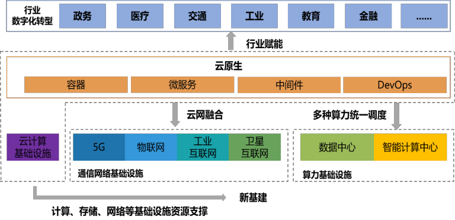

## 什么是云原生

> 作者: 小笼包  
> 2022-12-03 小雨

### 何为云原生

**云原生**顾名思义，就是**生在云上、长在云上**。早在云原生概念被提出前，企业中就已有相关实践。比如，谷歌在2004年就开始使用了容器技术，2006推出的进程容器（Process Container），就是一种具有**云原生**特征的技术实践；2009年，Netflix等厂商就开始开始启动上公有云战略，将 IT 基础架构从自己的数据中心迁移到公共云上之外，并通过微服务架构，用较小的易管理软件组件替换单体程序。

<!-- more -->

业界公认的云原生概念，是在2013年由Pivotal公司的Matt Stine首次提出的，他将其定义为一系列云计算技术和开发管理方法的合集，包括DevOps、持续交付、微服务(MicroServices)、敏捷基础设施(Agile Infrastructure)和12要素(The Twelve-Factor App)等等。

  

2015年，云原生领域最具话语权的组织CNCF（Cloud Native Computing Foundation）成立，该组织对云原生的最初定义主要包含三个方面：应用容器化；面向微服务架构；应用支持容器的编排调度。2018年，随着云原生生态的壮大，CNCF更新了对云原生的定义：**云原生技术有利于各组织在公有云、私有云和混合云等新型动态环境中，构建和运行可弹性扩展的应用**。

### 云原生在现有的环境下成长性如何

Forrester数据显示，在2021年，全球云原生应用持续上升，组织中容器和无服务器技术的使用率在一年内都增长了75%以上。

Gartner预测，到2025年，将会有超过95%的新数字工作负载被部署在云原生平台上。

**未来的软件一定是长在云上，企业也必将长在云上**。随着**上云用数赋智**成为大势所趋，云原生这一提出不到十年的概念迎来了爆炸式增长。

### 云原生的核心技术

云原生从诞生起便不仅仅只是一项技术或一个产品，而是一种系统化方法论和技术的集合。

经过不断地演进与发展，目前云原生的核心主要是**微服务**、**容器**、**服务网格**、**不可变基础设施**和**声明式API**这五大关键技术。

#### 1、微服务

微服务区别于单体应用而生。传统的单体应用由于耦合度高、扩展性差、迭代缓慢等缺点，已无法适应移动互联时代用户体量以及访问量几何式倍增、用户需求快速变化的现状。微服务便应运而生，其本质上是对传统的单体应用根据业务领域和模块进行划分、解耦，拆分成一个一个单独部署、运行的微小应用。

  

#### 2、容器

容器是是一种轻量级、可移植、自包含的软件打包技术，能够使应用程序在几乎任何地方以相同的方式运行。开发人员只要编写一次应用程序，无须任何修改就能够在生产系统的虚拟机、物理服务器或公有云主机上等任意位置运行。这种级别的可移动性，对于开发进程和供应商兼容性而言意义重大。

#### 3、不可变基础设施

基础设施的不可变性是指**运行服务的服务器在完成部署后，就不再进行更改。如果需要以任何方式更新，修复或修改某些内容，则会根据具有相应更改的公共镜像构建新服务器以替换旧服务器**。

不可变基础架构的好处包括基础架构中更高的一致性和可靠性，以及更简单，更可预测的部署过程，它可以缓解或完全防止可变基础架构中常见的问题，例如配置漂移和雪花服务器。

#### 4、服务网格

服务网格是指用以处理服务与服务之间通信的基础设施层。在实践中，它是一组和应用服务部署在一起的轻量级的网络代理，并且对应用服务透明。

#### 5、声明式API

声明式API是一种能够一次处理多个写操作、具备Merge能力的API。区别于命令式API直接发出的让服务器执行的命令，声明式API声明的是期望的状态，系统将不断地调整实际状态，直到与期望状态保持一致。

### 云原生架构

**基于云原生技术的一组架构原则和设计模式的集合便是云原生架构**。云原生架构可以帮助企业和开发充分利用云平台所提供的平台化能力和弹性资源能力，让开发人员将精力聚焦于业务。

云原生架构的架构原则如下图所示，通过遵从这些架构原则可以让技术主管和架构师在做技术选择时不会出现大的偏差。

根据全球企业增长咨询公司沙利文的报告，除互联网和信息服务等数字原生行业外，制造、政务、医疗等传统行业的云原生用户占比呈现较强的增长态势。据中国信通院调查，不同行业对云原生应用的核心诉求存在一定差异，细粒度、极致弹性、交付标准化、异构资源统一纳管、开放架构是企业对云原生的主要关注点。

云原生由数字化转型催生，同时，它又以其**极致弹性、自动部署、开放共享、按需服务、自治管理、独立高效等特性**，帮助政企数字化释放新生产力。

#### 1、极致弹性

弹性计算是云计算的核心特征，也是云原生技术中容器的重要特征。云原生应用弹性，包括应用使用资源的弹性和应用实例弹性扩展的弹性。在单实例扩展资源遭遇瓶颈时，可以配合负载均衡机制实现容器实例的弹性扩展。如以Kubernetes为代表的容器来提供离散和可重用的功能，这些功能以良好描述的方式集成，甚至跨越多云等技术边界，这使得交付团队可以使用重复的自动化和编排来快速迭代。

#### 2、自动部署

云原生方法远优于传统的面向虚拟化的业务流程，传统方法需要投入大量的精力来构建开发环境，以及软件交付过程中的其他不同环境。而云原生架构具备自动化和组合功能，并且依赖于可靠、经过验证和审核的已知良好流程的基础，交付十分敏捷，而不再需要人工干预重复执行。

#### 3、开放共享

云计算可以分为IaaS、PaaS、SaaS三种类型，分别通过这三种类型实现资源共享、平台共享、应用共享。而云原生应用则是部署在IaaS或PaaS层，通过SaaS层提供开放式服务。

#### 4、按需服务

云应用部署在云端，客户可以根据自己的需求，通过网络访问，自助使用服务，不需要联系云应用管理人员。通常会有个云应用服务目录，每个应用服务都有使用说明，通过服务目录可以找到适合自己满足自身需求的应用。

#### 5、独立高效

云原生带来了微服务化架构，一个微服务基本是一个能独立发布的应用服务，因此可以作为独立组件升级、灰度或复用等，对整个大应用的影响也较小，每个服务可以由专门的组织来单独完成，依赖方只要定好输入和输出口即可完全开发、甚至整个团队的组织架构也会更精简，因此沟通成本低、效率高。

云原生的这些特性极大地释放了云的红利，它能帮助企业构建弹性可靠、松耦合、易管理可观测的应用系统，提升交付效率，降低运维复杂度，让企业在竞争激烈以及疫情等不确定背景下保持一种高速迭代、持续创新的能力，成为驱动业务增长的重要引擎。

### 落地云原生的一点建议

云原生带来的不仅仅是应用的云上部署，而是意味着全新IT的重塑，包括开发模式、系统架构、部署模式、基础设施、组织文化等一系列的自动化、敏捷化演进和迭代，这些为企业的数字化转型带来了更多可能性，同时也带来了诸多挑战。

要进行全面云原生化的转型并非易事，抛开最基础的技术和资金的挑战不谈，在云原生的落地推广阶段，企业还需解决人员的思维与认知更新、新老技术如何融合、多云资源的管理、如何保障信息安全等问题。

#### 1、人员的思维和认知方面

目前各行业对云原生的认知尚有待完善。云原生有着庞大的技术与方法论体系，各行业的云原生应该是以更加全面的视角覆盖应用全生命周期的体系，而不只是简单的技术堆叠。而且云原生的学习成本较高，从开发阶段贯穿到运维阶段，云原生引入许多复杂、全新的技术，不只是编程语言，还有从K8S管理到各种CI/CD工具，学习难度与成本相当高。

#### 2、新旧技术的融合应用层面

目前许多企业倾向于对增量应用做云原生转型，但绝大部分的存量应用依旧在云下，是单体式架构。若想将所有存量应用从单体式重构成为分布式，需要按批次、慢节奏的逐步转型。而在转型分布式架构后，仍需选型应用层面的开发框架，做统一的技术栈管理。

#### 3、多云资源的管理方面

在公有云、私有云等多元化的云环境下，大家手头往往都有两套或者多套云资源，如何让这些割裂的云资源统一进行管理？如何基于一个平台让应用快速进行跨云迁移、发布？比如：开发在私有云，生产在公有云等这些问题伴随资源环境多元化问题会越来越突出。

#### 4、安全层面

云原生环境下，一些传统的安全工具无法适应新的云环境，无法有效保护跨集群、跨云的信息；此外，容器环境的快速发展迭代，也给安全保护策略的制定带来了难题；同时，虚拟化技术本身也对安全管控形成了一定的屏障。

#### 总结

对于要入局云原生的企业来说，首先要梳理好完整的云原生全景图，并对自身做好充分的现状分析，并基于业务目标梳理并制定平台与应用两方面的目标架构，制定可执行的分阶段的实施计划，并完善更新相应的安全保护策略与工具，从而在保障安全的前提下，将云原生的效能最大化。

转载至：[一文读懂什么是云原生｜推荐收藏](https://www.toutiao.com/article/7172471740210414087/?app=news_article&timestamp=1670034577&use_new_style=1&req_id=20221203102937010135160158072E8E95&group_id=7172471740210414087&share_token=53CE7286-6152-41A0-A1E4-DED95E7740D0&tt_from=weixin&utm_source=weixin&utm_medium=toutiao_ios&utm_campaign=client_share&wxshare_count=1&source=m_redirect)
