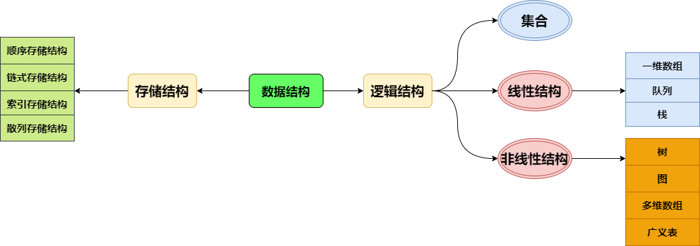

## 数据结构学习与总结

> 作者: 小笼包  
> 2021-04-06 多云

### 什么是数据结构：  

  

<!-- more -->
 
- 数据结构研究的内容包括数据的逻辑结构、存储结构和数据的运算。

- 数据的同一种逻辑结构，可以对应多种不同的存储结构。

### 算法

#### 算法的五个准则：
- 输入：算法开始前必须给算法中用到变量初始化，一个算法的输入可以包含零个或多个数据。
- 输出：算法至少有一个或多个输出。
- 有穷性：算法中每一条指令的执行次数都是有限的，而且每一步都在有穷时间内完成，即算法必须在执行有限步骤后结束。
- 确定性：算法中每条指令的含义都必须明确，无二义性。
- 可行性：算法是可行的，即算法中描述的操作都可以通过有限次的基本运算来实现。

### 查找
- 散列查找中处理冲突时,可以采用开放定址法，开放定址法的是：线性探查法、二次探查法、双重散列法。

- 假设m个关键字互为同义词,若用线性探查法把这m个关键字存入散列表中,至少要进行的探查次数是：m(m+1)/2。

- 查找较快,且插入和删除操作也比较方便的查找方法是：分块查找。

- 顺序查找算法的平均时间复杂度为: o(n)。

### 排序
- 比较次数与待排序列初始状态无关的排序方法是：直接选择排序。

- 在直接插入排序、冒泡排序和快速排序中,平均时间性能最佳的是：快速排序。

- 直接插入、直接选择、冒泡排序算法的时间复杂度为 O（n^2)。

- 快速、归并、堆排序的时间复杂度为 O(nlog2n)。

- 希尔排序算法时间复杂度接近于 O(nlog2n) 或者 o(n^1.25)。

- 基数排序时间复杂度O(d*(rd+n)), rd是基数， d是关键字，n是元素个数。

- 直接插入、冒泡、归并、基数排序是稳定的， 直接选择、希尔、快速、堆排序是不稳定的。

- 直接插入、直接选择、冒泡、希尔、堆排序的空间复杂度是 O（1）。

- 快速排序的空间复杂度是O(nlog2n)。

- 归并排序的空间复杂度是o（n）。

- 基数排序的空间复杂度是 o（n+rd）。

### 图
- 用邻接矩阵存储图时,广度优先搜索遍历算法的时间复杂度为: o($n^2$)。

- 无向图中任意两个不同的顶点间都有路径,则称该图为：连通图。

- 迪杰斯特拉(Dijkstra)算法的功能是：求图中某顶点到其他顶点的最短路径。

- 稀疏矩阵的三元组表是顺序存储结构。

- 有向图中所有顶点入度之和与所有顶点出度之和的比是1。

- 含有n个顶点和e条边的有向图的邻接矩阵中，零元素的个数是 $n^2$-e。

- 邻接表是图的 链式 存储结构。

- 一个无向连通图的生成树是含有该连通图的全部顶点的 极小连通 子图。

- 一个带权的无向连通图的最小生成树有 一棵或者多棵。

- n个顶点的连通图最多 n(n-1)/2 条边。

- 图G有n个顶点e条边，进行深度优先搜索的时间复杂度至多 O(n+e) ， 广度优先搜索的时间复杂度至多 O(n+e)。

- 有向图G的邻接矩阵表示，计算第i个结点的入度的方法是 求矩阵的列非零元素之和。

- 图的生成树 不是 唯一的， 一个连通图的生成树是一个 最小连通子图，n个顶点的生成树有 n-1条边。

- 对于一个具有n个顶点和e条边的无向图，采用邻接矩阵表示，表头向量的大小为 n ， 所有领接表中的结点总数是 2e 。

### 树

- 二叉树的线索链表利用空指针域存放遍历时得到的前趋或后继结点的指针。

- 当用二叉链表作为n个结点的二叉树的存储结构时，空指针域的个数是 n+1。

- 树的前序遍历序列等同于该树对应二叉树的前序遍历序列。
