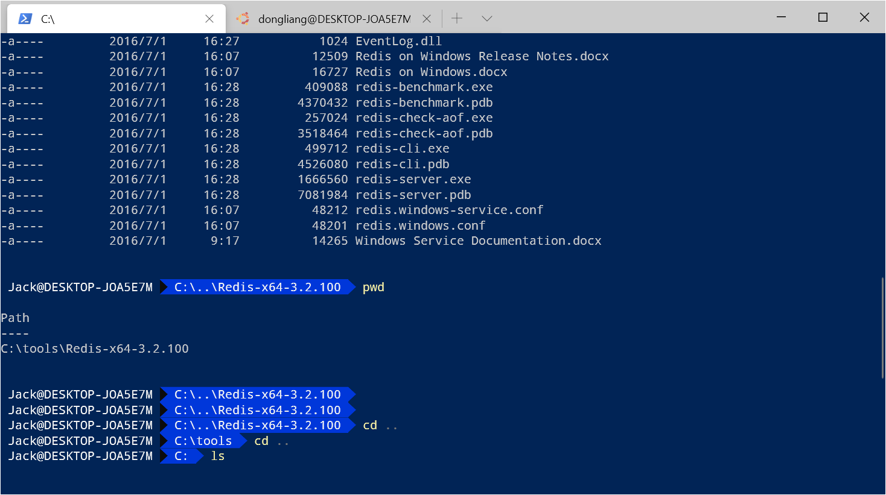

# PowerShell终端美化

> 作者: 小笼包  
> 2020-03-31 阴

## 前言

PowerShell在我日常中经常使用,其强大的命令集和友善的交互界面一直是windows操作系统上我首选的终端服务之一。  
今天记录下自己美化PowerShell的方式,与Linux终端美化相似使用 **agnoster** 主题。  

## 安装步骤

安装前确保电脑上已经安装了 **git** ,可以通过git指令下载项目。  

1、安装 Chocolatey

``` shell
# Set-ExecutionPolicy Bypass -Scope Process -Force; [System.Net.ServicePointManager]::SecurityProtocol = [System.Net.ServicePointManager]::SecurityProtocol -bor 3072; iwr https://chocolatey.org/install.ps1 -UseBasicParsing | iex
```

2、下载powerline字体

``` shell
# git clone https://github.com/powerline/fonts.git --depth=1

# cd fonts

#./install.ps1
```

3、安装oh-my-posh 

``` shell
# Install-Module posh-git -Scope CurrentUser
```

可能需要等待 1 分钟的时间，不要点回车。在第一次提示处输入 Y，在第二次提示处输入 A。  

接着执行下面命令来完成 oh-my-posh 的安装，并在提示处输入 Y:  

``` shell
# Install-Module oh-my-posh -Scope CurrentUser
```

接下来在PowerShell执行以下命令检测并初始化 Profile 文件（类似 Linux bash 中的.bashrc 文件）保存我们的配置： 

``` shell
# if (!(Test-Path -Path $PROFILE )) { New-Item -Type File -Path $PROFILE -Force }

# notepad $PROFILE
```

根据通过命令显示的路径找到 **Microsoft.PowerShell_profile.ps1** 文件,我在操作时候其实不需要找自动直接帮我们打开了这个空文件  

打开它并写入：

``` text
Import-Module posh-git
Import-Module oh-my-posh
Set-Theme Agnoster
```

这样我们就成功使用了 **Agnoster** 主题了,样式我觉得挺好看的,这里注意记得修改下Powershell的字体,改成刚下载的 **Powerline** 提供的字体,看自己喜好设置,这里就不作过多介绍了,如有疑问百度搜下"如何修改Powershell字体"。  

下面展示下美化后的样子：  
